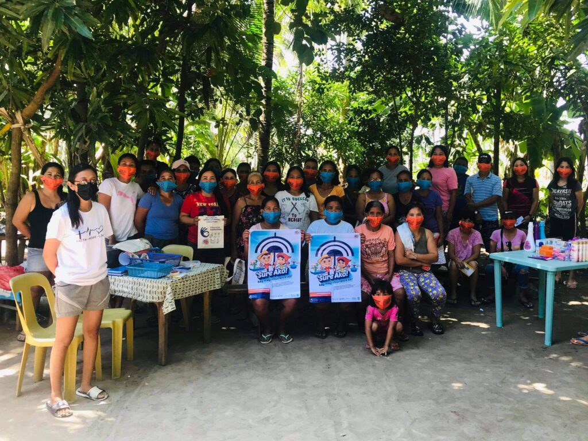
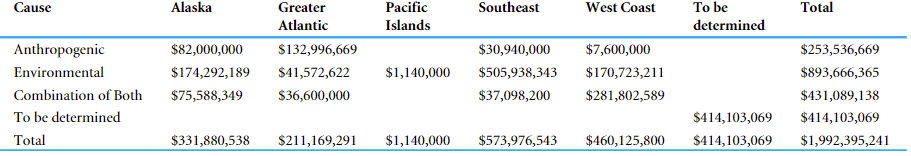
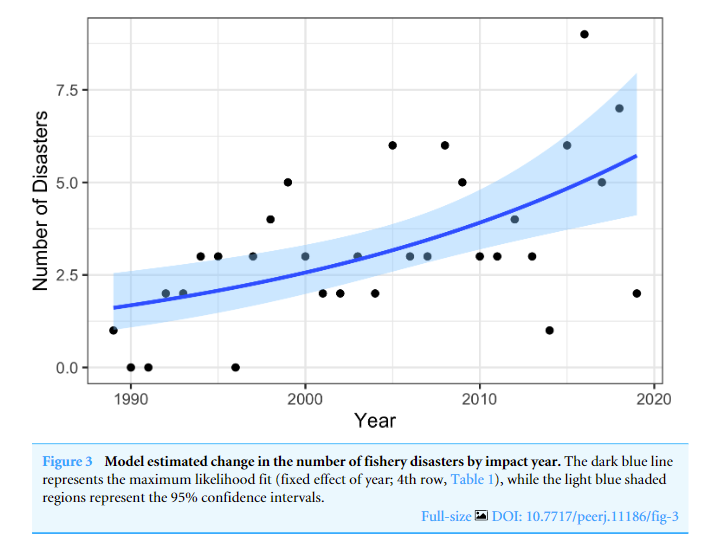

```{r setup, include=FALSE}
knitr::opts_chunk$set(echo = FALSE,message = FALSE,warning=FALSE)

xaringanExtra::use_tile_view()

```

# Fishing is a risky business

.pull-left[
- Fishing is vulnerable to stochastic weather shocks

- Shocks are becoming more frequent and devastating

    - Marine Heat Wave in 2015 in the Pacific
    
    - Warm water and disease collapsed 95% of the New York scallop fishery in 2019

- Limited access to financial tools to smooth risk and stabilize income
]

.pull-right[
```{r}
knitr::include_graphics(here::here("Presentations","imgs","snow_crab.png"))
```

 "Hope and pray" is their best current response
]

## _Push to use Insurance as a means to transfer fisher risk_

???

Easy for recreational fishers to shrug off uncertainty, but what if this catch is your livelihood? The incentives to ensure catch may suddenly be higher pushing fishers to choose strategies that hurt the underlying biomass

---

# Index Insurance leading candidate for fisheries insurance


```{r fig.align='center',out.width="90%"}
knitr::include_graphics(here::here("Presentations","imgs","windex.png"))
```


## .seagreen[No overarching framework to ask How? Where? and Should? index insurance be used in fisheries]

???
Specifically designed for quick payouts, flexible trigger design, and minimize moral hazard

By offering an insurance contract fishers may reoptimze their effort decisions

---

# Research Questions

## 1) Will index insurance change optimal input use?

  - Overfishing remains a driver of fishery collapse
    
  - At a minimum, insurance should not increase fishing pressures
    
  - Perhaps it incentives behavior change that relieves fishing pressure

## 2) What conditions lead to viable index insurance products where fishers demand insurance and insurers willing to provide?

---

# Insurance leads to moral hazards

##.bold[Moral Hazard]: .gold[*"Decisions by insured agents that they would not otherwise take if they were uninsured"*]

## Two components of Moral Hazards

  -   "Risk Reduction" : With insurance I want to take more risk than before because insurance protects me
  
  -   "Chasing the Trigger" : If I change my behavior, I increase the probability of getting paid out


<uc-blockquote> Index Insurance negates "Chasing the Trigger", but is still subject to Risk Reduction and therefore may cause fishers to change their input decisions </uc-blockquote>
---

# Risk effects on input use

.pull-left[
- Input risk effects dictate whether a farmer wants to add more or less inputs .small[(Ramaswami 1993; Horowitz and Lichtenberg, 1993)]

- Applying more fertilizer increases volatility, but also yield

- Risk-increasing inputs rise with insurance

- Risk-decreasing inputs lower with insurance

]

.pull-right[

```{r fig.align='center',out.width="90%",fig.cap="Covers protect against frost, but dont increase average yield"}
knitr::include_graphics(here::here("Presentations","imgs","frost.jpg"))
```

]
---

# Do fishery inputs have risk effects?

- Probably, but not often described or modeled

- Fishers respond to risk

    - Inputs have more spatial and temporal variety than agriculture, so captains choose known locations and good times
    
    - Fishers prefer consistency in harvest 
    
    - "Sometimes if I don't make enough money to pay my crew, I make one or two days more. If I can get $5,000 or $10,000 more it's OK"  (Holland 2008)


Empirically, marginal inputs such as fuel and labor may be risk-decreasing while fixed inputs such as vessel size may be risk-increasing .small[(Asche et al., 2020)]


---

# Index Insurance changes input use

.pull-left[

## Empircal Evidence

- Maize farmers use more fertilizer in Kenya .small[(Sibiko et al., 2020)]

- Relaxing capital constraints for low income farmers
]

.pull-right[
## Theory in the common pool

- Pastoralists stock more animals leading to environmental degradation .small[(Bulte et al., 2021; Muller et al., 2011)]

- Both studies implicitly assume risk increasing inputs
]

<uc-blockquote> Fisheries use multiple inputs with possible risk effects. How does fishing pressure respond to index insurance under various risk effects?  </uc-blockquote>


---
name: model

# Traditional fishing models constrain fishing actions to risk-increasing 

Show dv/de is always positive

I need to build a new model to incorporate risk effects

---

# Profit is subject to an additive shock to biomass


$$\begin{aligned}
\pi(e,z)&=pqe^\alpha(B+z)-c(e) \\
z&\sim N(0,\sigma_z)
\end{aligned}$$

.pull-left[
Where $\pi(e,z)$ is fisher profit

$e$ is the input

$q$ is the catchability coefficient

$p$ is price

]
.pull-right[

$B$ is the expected fish population

$\alpha$ is the mean production elasticity 

$z$ is random normally distributed shock

$c(e)$ is a cost function
]

## Add risk effects by allowing the input more control on the shock term


$$\begin{aligned}
&\pi(e,z)=pqe^\alpha B+pqe^\beta z-c(e) \\ \\
\text{When }& \beta<0 \text{, input is risk decreasing} \\
\text{When }& \beta>0 \text{, input is risk increasing}
\end{aligned}$$

---

# Fisheriers are dynamic and are common pool resources

- Assume fish stock has logistic growth based on the expected amount of biomass and n fishers actively harvest the resource

$$\begin{aligned}
\frac{dB}{dt}&=rB(1-\frac{B}{K})-q\sum^n_{i=1}e_i^\alpha B &\text{Equilibrium when }\frac{dB}{dt}=0 \\
B&=k(1-\frac{q\sum^n_{i=1}e_i^\alpha}{r}) &\text{Solve for B}
\end{aligned}$$

.center[.bold[Sub bioeconomic equilibrium biomass back into individual profit function]]

$$\pi_i(e_i,z)=pqe_i^\alpha k(1-\frac{q(e_i^\alpha+\sum^{n-1}_{j=1}e_j^\alpha}{r})+pqe_i^\beta z-c(e_i)$$

---

## .blue[Fishers maximize expected utility by choosing individual effort and insurance payouts] 


$$\begin{aligned}
\max_{e_i,\gamma}\mathbb{E}[U]&=F(\bar{w})U_b(\pi_i(e_i,z),\gamma,p(\gamma)) &\text{Bad State} \\
&+(1-F(\bar{w}))U_g(\pi_i(e_i,z),p(\gamma)) &\text{Good State}
\end{aligned}$$

.pull-left[

$\gamma$ = insurance payout

$\bar{w}$ = trigger

$p(\gamma)$ = premium

]

.pull-right[
.bold[Utility is concave]

$\frac{\partial U}{\partial E}>0$

$\frac{\partial^2 U}{\partial E^2}<0$
]

.center[.bold[Contract specifications:]]

$$\begin{cases}
\gamma & w<\bar{w} \\
0 & w>\bar{w}
\end{cases}$$


.center[.bold[Observed weather w is jointly distributed with the productivity shock and [leads to basis risk](#basis)]]
.small[
$$\begin{pmatrix}
z \\
w 
\end{pmatrix}\sim N\left(\begin{pmatrix}
0 \\
0
\end{pmatrix},\begin{pmatrix}
\sigma_z^2 & \rho\sigma_z\sigma_w \\
\rho\sigma_w\sigma_z & \sigma_w^2
\end{pmatrix}\right)$$

]

---
name: methods

## .blue[Find solutions for a symmetric Nash equilibirum and a social planner]

.pull-left[
- I need to think on how to numerically solve the NE

- For now, I model just one fisher with a given equilibrium stock
]

.pull-right[Social Planner solves all $e_i$ simultaneously 

- Since its symmetric sub in $\pi=pqe_i^\alpha k(1-\frac{qne_i^\alpha}{r})+pqe_i^\beta z-c(e_i)$
]

## .blue[Numerical simulation]

- Monte Carlo simulation with 1000 draws from copula linked marginal distributions of $z$ and $w$

- Non-linear optimization algorithm maximizes input and payout choices

- Run 19,800 scenarios for each combination of variables .small[[Risk Aversion, Basis Risk Correlation, Premium Loading Factor, Trigger Coverage, Input Risk Effects]]


---

# Contributions to literature

## 1) First index insurance model built through a fishery perspective

- .seagreen[Conservation Finance, Fisheries management]

## 2) First index insurance model to examine input use with risk effects

- .seagreen[Risk management literature, insurance]

## 3) First model adding basis risk into optimal input decision

- .seagreen[Index Insurance literature]

---
# Discussion

.bold[.blue[Index Insurance is feasible in fisheries, but will have different impacts depending on the risk effects of the input]]

## Immediate Questions

- Do you buy the risk effect specification and its importance?

- What other considerations would you consider for proving insurance feasibility?

## Future goals and questions

- Move to two input model with mixed risk effects

- Can we identify risk effects of a fishery without expensive and time-consuming empirical studies?

- Test correlations of fisheries with potential indices


---
class: title-slide-section-gold, center, middle

# Extra Slides

---

# Active Insurance pushes

.pull-left[
- Caribbean Oceans and Aquaculture Sustainability Facility (COAST)

    - Index Insurance product to protect fishers from hurricanes and tropical storms

    - Quid Pro Quo style of conservation, requires vessel regrestration 
    
- RARE Initiative to build index insurance in the Philippines

    - Pilot enrolled 4,000 fishers
    
    - Expected to reach 50,000
    
    - Operated through Savings Clubs
    
    - Anecdotal behavior change

]

.pull-right[


]

---

# One previous attempt at fishing productivty insurance

Concluded a US RMA like revenue and yield insurance program would be unsuccessful. Instead better management is the solution (Herrmann et al., 2004)

1. Insurance cost deemed to high to US RMA standards

2. Difficulty in defining fishery peril (how exactly does weather impact a fisher?)

3. Moral hazard of "fishing the insurance"
  
  - Operators staying in when earning payouts instead of exiting
  
No definitive follow up study in 20 years and interest in fizzled out
  
<uc-blockquote>However, insurance may be possible in other fisheries. New insurance products and fishery technology have come online to improve viability of insurance. Behavior was ignored in determining fisher responses and there was no formalization of the full moral hazard effect </uc-blockquote>

---

# Moral Hazards will always influence behavior

##.bold[Moral Hazard]: .gold[*"Decisions by insured agents that they would not otherwise take if they were uninsured"*]

## Two components of Moral Hazards

  -   "Risk Reduction" : With insurance I want to take more risk than before because insurance protects me
  
  -   "Chasing the Trigger" : If I change my behavior, I increase the probability of getting paid out


<uc-blockquote> Index Insurance negates "Chasing the Trigger", but is still subject to Risk Reduction and therefore may cause fishers to change their input decisions </uc-blockquote>
---

# There are three pathways for insurance to change behavior

1. Quid Pro Quo

  - Fishers want insurance and are willing to agree to conservation improving stipulations

2. Collection Action

  - Insurance leverages the political economy to pressure the regulator or promote collective cooperation

3. Moral Hazards

  - "Risk Reduction" : With insurance I want to take more risk than before because insurance protects me
  
  - "Chasing the Trigger" : If I change my behavior, I increase the probability of getting paid out
  
<uc-blockquote> My paper will focus on moral hazard behavior change because no matter the design or setting, some influence will be present. </uc-blockquote>
  
  
???

Kotchen and Salant offer a possible theory justification for moral hazards in the short term for fisheries. Increase the cost initially to see biological improvements, insurers bear the initial cost.

---

# Federal fishery diaster relief (Bellquist et al., 2021)


.center[
]
     
     
---

# Insurance exists on a spectrum


---
name: basis

# Adding Basis Risk into model 

$$\begin{pmatrix}
z \\
w 
\end{pmatrix}\sim N\left(\begin{pmatrix}
0 \\
0
\end{pmatrix},\begin{pmatrix}
\sigma_z^2 & \rho\sigma_z\sigma_w \\
\rho\sigma_w\sigma_z & \sigma_w^2
\end{pmatrix}\right)$$

The joint distribution of the random variables $z$ and $w$ is connected through a copula that uses $\rho$ as the correlation between the index and productivity shock. Update the utility maximization with all variables.

$$\begin{aligned}
\mathbb{E}[U]&=\int^\infty_{-\infty}\int^{\bar{w}}_{-\infty}f(z,w)(1-e^{-a(pqe_i^\alpha k(1-\frac{q(e_i+\sum^{n-1}_je_j)}{r})-c(e_i)+\gamma-\gamma F(\bar{w}))}dwdz &\text{Bad State} \\
&+\int^\infty_{-\infty}\int^\infty_{\bar{w}}f(z,w)(1-e^{-a(pqe_i^\alpha k(1-\frac{q(e_i+\sum^{n-1}_je_j)}{r})-c(e_i)-\gamma F(\bar{w}))}dwdz &\text{Good State}
\end{aligned}$$


---

# Demonstration of basis risk

```{r}
library(copula)
library(tidyverse)

  
  
  multi_perf<-mvdc(copula = normalCopula(param=1,dim=2),
                     margins=c("norm","norm"),
                     paramMargins = list(list(mean=0,sd=1),
                                         list(mean=0,sd=1)))
  
   multi_low<-mvdc(copula = normalCopula(param=0.2,dim=2),
                     margins=c("norm","norm"),
                     paramMargins = list(list(mean=0,sd=1),
                                         list(mean=0,sd=1)))
   
    multi_med<-mvdc(copula = normalCopula(param=0.8,dim=2),
                     margins=c("norm","norm"),
                     paramMargins = list(list(mean=0,sd=1),
                                         list(mean=0,sd=1)))
  n=1000
  set.seed(123)
  sim_perf<-as.data.frame(rMvdc(n,multi_perf))
  
  sim_low<-as.data.frame(rMvdc(n,multi_low))
  
  sim_med<-as.data.frame(rMvdc(n,multi_med))
  
  colnames(sim_low)=c("z","w")
  colnames(sim_perf)=c("z","w")
  colnames(sim_med)=c("z","w")
  
  low_plot<-ggplot(sim_low,aes(x=w,y=z))+
    geom_point(size=2,color="#003660")+
    scale_y_continuous(breaks=c(-2,-85,0,2),labels=c("-2","ztrig","0","2"),limits=c(-3,3))+
    scale_x_continuous(breaks=c(-2,-85,0,2),labels=c("-2","wtrig","0","2"),limits=c(-3,3))+
    theme_bw()+
    ggtitle("Basis Risk with\ncorrelation equal to 0.2")+
    theme(axis.title = element_text(size=24))+
    theme(axis.text = element_text(size=20))+
    theme(plot.title = element_text(size=28))+
    annotate("label",x=-2,y=2.5,label="Insurance pays out\nProductivity good",fill="yellow",size=6)+
    annotate("label",x=2,y=2.5,label="Insurance does not pay\nProductivity good",fill="green",size=6)+
    annotate("label",x=-2,y=-2.5,label="Insurance pays out\nProductivity bad",fill="green",size=6)+
    annotate("label",x=2,y=-2.5,label="Insurance does not pay\nProductivity bad",fill="red",size=6)+
    geom_hline(yintercept=-.85,color="#FEBC11",size=1.75)+
    geom_vline(xintercept=-.85,color="#FEBC11",size=1.75)
  
  med_plot<-ggplot(sim_med,aes(x=w,y=z))+
    geom_point(size=2,color="#003660")+
    scale_y_continuous(breaks=c(-2,-85,0,2),labels=c("-2","ztrig","0","2"),limits=c(-3,3))+
    scale_x_continuous(breaks=c(-2,-85,0,2),labels=c("-2","wtrig","0","2"),limits=c(-3,3))+
    theme_bw()+
    ggtitle("Basis Risk with\ncorrelation equal to 0.8")+
    theme(axis.title = element_text(size=24))+
    theme(axis.text = element_text(size=20))+
    theme(plot.title = element_text(size=28))+
    annotate("label",x=-2,y=2.5,label="Insurance pays out\nProductivity good",fill="yellow",size=6)+
    annotate("label",x=2,y=2.5,label="Insurance does not pay\nProductivity good",fill="green",size=6)+
    annotate("label",x=-2,y=-2.5,label="Insurance pays out\nProductivity bad",fill="green",size=6)+
    annotate("label",x=2,y=-2.5,label="Insurance does not pay\nProductivity bad",fill="red",size=6)+
    geom_hline(yintercept=-.85,color="#FEBC11",size=1.75)+
    geom_vline(xintercept=-.85,color="#FEBC11",size=1.75)
  
  perf_plt<-ggplot(sim_perf,aes(x=w,y=z))+
    geom_point(size=2,color="#003660")+
    scale_y_continuous(breaks=c(-2,-85,0,2),labels=c("-2","ztrig","0","2"),limits=c(-3,3))+
    scale_x_continuous(breaks=c(-2,-85,0,2),labels=c("-2","wtrig","0","2"),limits=c(-3,3))+
    theme_bw()+
    ggtitle("Basis Risk with\ncorrelation equal to 1")+
    theme(axis.title = element_text(size=24))+
    theme(axis.text = element_text(size=20))+
    theme(plot.title = element_text(size=28))+
    annotate("label",x=-2,y=2.5,label="Insurance pays out\nProductivity good",fill="yellow",size=6)+
    annotate("label",x=2,y=2.5,label="Insurance does not pay\nProductivity good",fill="green",size=6)+
    annotate("label",x=-2,y=-2.5,label="Insurance pays out\nProductivity bad",fill="green",size=6)+
    annotate("label",x=2,y=-2.5,label="Insurance does not pay\nProductivity bad",fill="red",size=6)+
    geom_hline(yintercept=-.85,color="#FEBC11",size=1.75)+
    geom_vline(xintercept=-.85,color="#FEBC11",size=1.75)
  
```

.column-left[
```{r}
low_plot
```

]

.column-center[
```{r}
med_plot
```

]

.column-right[
```{r}
perf_plt
```

]


---

# Index Insurance demand determined by multiple factors

.pull-left[

## Basis Risk

- .moss[Paying premiums in bad states of the world without receiving payouts drastically hurts welfare .small[(Clarke 2016)]]

- .moss[Fisheries have difficulty establishing clear weather impacts to productivity .small[(Free et al., 2019; Lehodey et al., 2006)]]
]


.pull-right[

## Costs

- .moss[Expensive premiums diminish fishers willingness to pay .small[Binswanger 2012]]

- .moss[Competitive market insurance needs to make some profit beyond just covering payouts]
]


<uc-blockquote> Is is possible to offer an insurance product through a competitive market in a new industry with unknown basis risk? </uc-blockquote>


