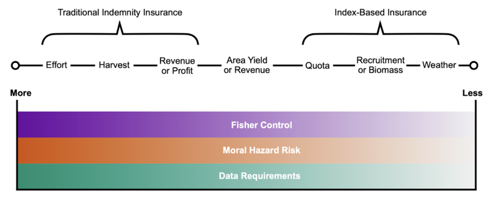

```{r setup, include=FALSE}
knitr::opts_chunk$set(echo = FALSE,message = FALSE,warning=FALSE)
```

# Is it possible to design incentive compatible fisheries productivity insurance?

.column-left[]

.column-center[]

.column-right[]

---

# Insurance protects against randomness

- Fishing is a stochastic activity

- Harmful environmental shocks severely impact the welfare of fishing communities and productivity of fish stocks

- Risk averse fishers will value protection from shocks offered by productivity insurance

- However, by adapting insurance fishers will change their behavior

- How can we guarantee behavior changes that improve resource conservation?

- Why hasn't insurance been implemented yet?

---

# One previous attempt at fishing productivty insurance

Concluded a US RMA like revenue and yield insurance program would be unsuccessful. Instead better management is the solution (Herrmann et al., 2004)

1. Insurance cost deemed to high to US RMA standards

2. Difficulty in defining fishery peril (how exactly does weather impact a fisher?)

3. Moral hazard of "fishing the insurance"
  
  - Operators staying in when earning payouts instead of exiting
  
No definitive follow up study in 20 years and interest in fizzled out
  
<uc-blockquote>However, insurance may be possible in other fisheries. New insurance products and fishery technology have come online to improve viability of insurance. Behavior was ignored in determining fisher responses and there was no formalization of the full moral hazard effect </uc-blockquote>

---
class: highlight-last-item

# There are three pathways for insurance to change behavior

--

1. Quid Pro Quo

  -   Fishers want insurance and are willing to agree to conservation improving stipulations

--

2. Collection Action

  -   Insurance leverages the political economy to pressure the regulator or promote collective cooperation
  
--

3. Moral Hazards

  -   "Risk Reduction" : With insurance I want to take more risk than before because insurance protects me
  
  -   "Chasing the Trigger" : If I change my behavior, I increase the probability of getting paid out
  
<uc-blockquote> My paper will focus on moral hazard behavior change because no matter the design or setting, some influence will be present. </uc-blockquote>
  
  
???

Kotchen and Salant offer a possible theory justification for moral hazards in the short term for fisheries. Increase the cost initially to see biological improvements, insurers bear the initial cost.

---

# Moral Hazards can improve conservation if channeled correctly

.pull-left[## Agriculture

Theory shows insurance has ambiguous effects on risk-increasing inputs (Ramaswami, 1992)

Crop revenue insurance reduces fertilizer use in winter wheat (Mishra et al., 2005)

]

.pull-right[## Fisheries

Free riding (a moral hazard) reduces over exploitation of common-pool resources in cooperatives and partnerships (Heintzelman et al., 2008)

Revenue sharing acts like insurance and promotes resource conservation (Tillman et al, 2018)


]

<uc-blockquote>The characteristics of the insurance and the specific fishery determine if a positive moral hazard effect will lead to incentive compatibility. </uc-blockquote> 

---

# Insurance exists on a spectrum



---

# Represent the spectrum through a utility maximizing fisher
.big[
$$
\begin{aligned}
\max_{E,d}\mathbb{E}[U(E,B,d)]&=F(\bar{T})\pi(E,B,d|T<\bar{T})  &\text{Bad State}\\ &+(1-F(\bar{T}))\pi(E,B,d|T\ge\bar{T}) &\text{Good State}
\end{aligned}
$$
]
.pull-left[ .center[Variable definition]

$T$ = The observed index

$\bar{T}$ = The trigger value

$E$ = effort (input)

$B$ = Biomass (environment)

$d$ = payout

Note: premium is endogenous on $d$ and $F(\bar{T})$

]

.pull-right[.center[Conditions]

Profit is concave in the effort input

$\frac{\partial\pi}{\partial E}>0$

$\frac{\partial^2\pi}{\partial^2 E}<0$

---


]