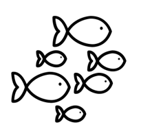

```{r setup, include=FALSE}
knitr::opts_chunk$set(echo = FALSE,message = FALSE,warning=FALSE)

xaringanExtra::use_tile_view()
#xaringanExtra::use_scribble()
```

# Insurance is an ideal tool to smooth risk

- Fisheries are highly variable

- Climate Change will increase stochastic shocks

- Overfished stocks more vulnerable to climate variability

  -   Overfishing continues to impact fisheries, especially in developing countries
  
- Greater attention from the UN and governments to mitigate risk for risk-averse fishers

- Insurance products being designed to combat climate shocks

## .seagreen[No overarching framework to ask How? Where? and Should? insurance be used in fisheries]

---

# Potential to leverage insurance induced behavior change to correct externalities in fisheries

## Moral Hazards are often undesirable in insurance

1. Farmer intentionally reduces yield to get an insurance payout

## .small[In fisheries with risk-sharing agreements, moral hazards leads to reduced overexploitation]

2. Revenue club encourages free riders to reduce total harvest

3. A fisher intentionally lowers harvest for an insurance payout leads to less overfishing

???

Heintzelman et al., 2008 and Tillman 2018 primary backbones in this idea.

Kotchen and Salant offer a possible theory justification for moral hazards in the short term for fisheries. Increase the cost initially to see biological improvements, insurers bear the initial cost.


---
class: no-scribble

# What Moral Hazards exist in a fishery

## Two components of Moral Hazards

  -   "Risk Reduction" : With insurance I want to take more risk than before because insurance protects me
  
  -   "Chasing the Trigger" : If I change my behavior, I increase the probability of getting paid out
  
<uc-blockquote> How can we design insurance to induce positive behavior change? </uc-blockquote>


---

# Insurance must be incentive compatible


.column-left[

.large[.bold[ Fishers want to buy insurance]]
]

.column-center[

.large[.bold[Insurance changes behavior to promote conservation]]

]

.column-right[

 .large[.bold[Insurers willing to provide insurance]]
 
]

--

## .seagreen[This research will focus on behavior change originating from moral hazards]


---
name: milestones

# Research Objectives at PERC

## Build theoretical model to formally characterize behavior change from Insurance Induced Moral Hazards

.pull-left[[1.](#prop-1) How does insurance increase or decrease fishing effort?
  
  - Test across different triggers [Harvest - Area - Weather]
  
[2.](#prop-2) Will insurance improve fisher welfare?  

]

.pull-right[
[3.](#prop-3) Could an insurer act as a social planner?

[4.](#prop-4) Does adverse selection create leakage problems?

[5.](#prop-5) Entry-Exit Dynamics
]

## Simulate model outcomes with representative fishery and weather data

1. Capture metrics of interest for insurance companies (Expected Negative Profits, Required Capital, etc.)

2. Show potential dynamic effects. 


---
class: title-slide-section-gold, center, middle

# Extra Slides
---

# Active Insurance pushes

.pull-left[
- Caribbean Oceans and Aquaculture Sustainability Facility (COAST)

    - Index Insurance product to protect fishers from hurricanes and tropical storms

    - Quid Pro Quo style of conservation, requires vessel regrestration 
    
- RARE Initiative to build index insurance in the Philippines

    - Pilot enrolled 4,000 fishers
    
    - Expected to reach 50,000
    
    - Operated through Savings Clubs
    
    - Anecdotal behavior change

]

.pull-right[

]

---

# One previous attempt at fishing productivty insurance

Concluded a US RMA like revenue and yield insurance program would be unsuccessful. Instead better management is the solution (Herrmann et al., 2004)

1. Insurance cost deemed to high to US RMA standards

2. Difficulty in defining fishery peril (how exactly does weather impact a fisher?)

3. Moral hazard of "fishing the insurance"
  
  - Operators staying in when earning payouts instead of exiting
  
No definitive follow up study in 20 years and interest in fizzled out
  
<uc-blockquote>However, insurance may be possible in other fisheries. New insurance products and fishery technology have come online to improve viability of insurance. Behavior was ignored in determining fisher responses and there was no formalization of the full moral hazard effect </uc-blockquote>

---

# There are three pathways for insurance to change behavior

1. Quid Pro Quo

  -   Fishers want insurance and are willing to agree to conservation improving stipulations


2. Collection Action

  -   Insurance leverages the political economy to pressure the regulator or promote collective cooperation
  

3. Moral Hazards

  -   "Risk Reduction" : With insurance I want to take more risk than before because insurance protects me
  
  -   "Chasing the Trigger" : If I change my behavior, I increase the probability of getting paid out
  
<uc-blockquote> My paper will focus on moral hazard behavior change because no matter the design or setting, some influence will be present. </uc-blockquote>
  
  
???

Kotchen and Salant offer a possible theory justification for moral hazards in the short term for fisheries. Increase the cost initially to see biological improvements, insurers bear the initial cost.


---

# Insurance exists on a spectrum


---

# Represent the spectrum through a utility maximizing fisher
.big[
$$
\begin{aligned}
\max_{E,\gamma}\mathbb{E}[U]&=F(\bar{T})\pi(E,B,\gamma,\rho|T<\bar{T})  &\text{Bad State}\\ &+(1-F(\bar{T}))\pi(E,B,\rho|T\ge\bar{T}) &\text{Good State}
\end{aligned}
$$
]
.pull-left[ .center[Variable definition]

$T$ = The observed index

$\bar{T}$ = The trigger value

$E$ = effort (input)

$B$ = Biomass (environment)

$\gamma$ = coverage

$\rho$ = premium

]

.pull-right[.center[Conditions]

Utility is concave in the effort input

$\frac{\partial U}{\partial E}>0$

$\frac{\partial^2U}{\partial E^2}<0$

Profit increasing in shock

$\frac{\partial \pi}{\partial B}>0$


]


---

# Federal fishery diaster relief (Bellquist et al., 2021)


.center[
]
     
     
---
name: prop-1

.bold[Proposition 1] *A change in insurance coverage leads to a change in the optimal effort of fishers. The sign and magnitude will change depending on the level of control a fisher has on the trigger.*

Proposed solution strategy: First solve for the First Order Conditions with different insurance contracts.

$$
\frac{\partial \mathbb{E}[U]}{\partial E}=0
$$

Next, take the total derivative of the first order conditions with respect to the insurance coverage level.

$$
\frac{d FOC}{d \gamma}=\frac{\frac{- \partial FOC}{\partial \gamma}}{\frac{\partial FOC}{\partial E}}
$$

- Denominator of the RHS must be negative by the definition of the maximum. 

- Only need to focus on the sign of $\frac{\partial FOC}{\partial \gamma}$. 

- Test three potential indices to cover the entire spectrum: Yield, Aggregate Yield, and Biomass.


[Back to Objectives](#milestones)

---
name: prop-2

.bold[Proposition 2] *Fishers choose a positive level of $d$ to increase their welfare*

- Proposition 1  pins down an optimal value, $E^*$ 

- Take FOC wrt $\gamma$ and sub in $E^*$, we ought to find some levels of $\gamma$ so that we test:

$$
\gamma^*>0
$$

[Back to Objectives](#milestones)

---
name: prop-3

.bold[Proposition 3] *An insurer could act as a manager by setting a uniform, socially optimal coverage level for all fishers. How would the effort from the insurer optimized value compare to standard social planner allocation?*

Use a Two-Step Optimization process

1. Fishers optimize effort for any level of $\gamma$

2. Insurer optimizes total welfare through accounting for aggregate effort and a uniform $\gamma$

Eventually relax the actuarially fiar assumption and allow insurers either some profit maximization, or subsidies to reach a social optimum.

[Back to Objectives](#milestones)

---
name: prop-4

.bold[Proposition 4] *Heterogeneity in fishers leads to some fishers opting out of insurance, potentially chipping away at the conservation gains by free riding the increase in biomass*

- Add heterogeneity i.e. $q_i,c_i$

- See if high vs low productivity types choose insurance at higher rates

- Test if those who opt out consume conservation gains aka leakage

- Complete information of others insurance decisions

[Back to Objectives](#milestones)

---
name:prop-5

.bold[Proposition 5] *Does insurance keep fishers in when they would otherwise exit the fishery?*

- Would those whose receive payouts stay in the fishery when they would have other wise opted out?

- Entry-Exit decisions with insurance on top

[Back to Objectives](#milestones)

---

# Moral Hazards can improve conservation if channeled correctly

.pull-left[## Agriculture

Theory shows insurance has ambiguous effects on risk-increasing inputs (Ramaswami, 1992)

Crop revenue insurance reduces fertilizer use in winter wheat (Mishra et al., 2005)

]

.pull-right[## Fisheries

Free riding (a moral hazard) reduces over exploitation of common-pool resources in cooperatives and partnerships (Heintzelman et al., 2008)

Revenue sharing acts like insurance and promotes resource conservation (Tillman et al, 2018)


]

<uc-blockquote>The characteristics of the insurance and the specific fishery determine if a positive moral hazard effect will lead to incentive compatibility. </uc-blockquote> 

---

# Basis Risk

- How correlated is the index to production?

- When does a fisher lose production, but isn't paid out? (Vice versa too)

.center[]

- Ag insurance seems content with 0.5 correlation at a minimum

- Kenyan pastoralists still exposed to 32% of risk after purchasing index insurance (Jensen et al., 2014)

---
background-image: url(imgs/free-warming.png)
background-size: contain

---

# Intuition builder: Simple Effort Insurance

.pull-left[

Simple profit maximizing fisher with an effort insurance contract

No uncertainty

No risk aversion

No premium

The more effort they abate the greater the payout $\gamma*(\bar{e}-e_i)$

Basically a payment for Ecosystem Service Model
]

```{r, echo=FALSE}
pi<-function(f,b=100,c=10,shape=2){
  pi=b*f-c*f^2
  
  return(pi)
}
# Insurance with payment based only on trigger threshold
pi_in<-function(f,alpha=30,ft=5,b=100,c=10,shape=2){
  
  if(f<ft){
    pi=b*f-c*f^shape+alpha*(ft-f)
  }else{
    pi=b*f-c*f^shape
  }
  return(pi)
}  

# Insurance with payment based of optimal effort
pi_in_fb<-function(f,alpha=30,ft=5,b=100,c=10,shape=2){
  fbar<-(b/(shape*c))^(1/(shape-1))
  
  if(f<ft){
    pi=b*f-c*f^shape+alpha*(fbar-f)
  }else{
    pi=b*f-c*f^shape
  }
  return(pi)
}
```


```{r, echo=FALSE,fig.cap="The black dots represent the profit maximizing point for each insurance policy including no insurance policy in red. The horizontal black line represents the no insurance profit maximizing point. Any point above this line shows the fishers are better off with that level of effort and payout structure. Trigger is shown by the dashed vertical black line.",fig.align='right'}
library(tidyverse)
library(latex2exp)

x<-seq(0,10,by=.1)

alpha_seq<-seq(0,100,by=15)
graph_ft4<-data.frame(alpha=NA,f=NA,pi=NA)
value<-vector(mode="numeric")
for(i in 1:length(alpha_seq)){
  for(k in 1:length(x)){
    value[k]=pi_in(f=x[k],alpha = alpha_seq[i],ft=4)
  }
  
  temp<-data.frame(alpha=rep(alpha_seq[i],length.out=length(x)),f=x,pi=value)
  graph_ft4<-rbind(graph_ft4,temp)
}

max_dots<-graph_ft4 %>% 
  drop_na() %>% 
  group_by(alpha) %>% 
  mutate(f=which.max(pi)) %>% 
  summarize(max=max(pi),f=unique(f))

max_dots$f<-x[max_dots$f]


pi_graphf4<-graph_ft4 %>% 
  drop_na() %>%  
  ggplot(aes(x=f,y=pi,color=as.factor(alpha)))+
    geom_line(size=2)+
    scale_color_brewer(palette="Spectral",)+
    theme_minimal()+
  labs(title=expression(paste("Insurance policies with ",e["i"],'=4')),x="Fishing Effort",y="Profit",color=expression(paste(gamma)))+
    geom_point(data=max_dots,aes(x=f,y=max),size=3,color="black")+
  geom_segment(aes(x=4,y=0,xend=4,yend=240),size=1.5,color="black",linetype="dashed")+
  geom_hline(yintercept=250)

pi_graphf4
```
