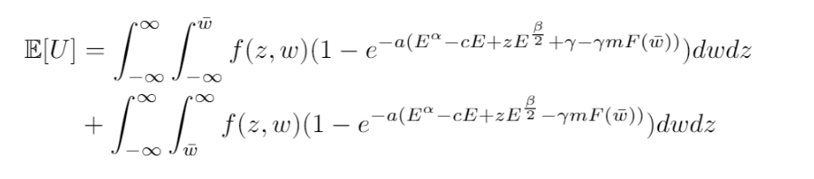

```{r setup, include=FALSE}
knitr::opts_chunk$set(echo = FALSE,message = FALSE,warning=FALSE)

xaringanExtra::use_tile_view()

```

# Individual fishers face a great deal of risk

.pull-left[
- Not even the best fishers can predict exactly how much they will catch

- Uncertainty of catch and income may incentivize fishers to choose biologically sub-optimal strategies

- Fishers can manage risk through input use

    - Add more capital
    - Choose days to avoid fishing (temporal effort)
    - Diversify fishing portfolio (spatial effort)

- Limited access to financial tools to smooth risk


]

.pull-right[
```{r fig.cap="Credit: Gonzalez Banda-Cruz"}
knitr::include_graphics(here::here("Presentations","imgs","caleta_vessel.JPG"))
```


]

## _Push by UN and NGOs to use Insurance as a means to transfer fisher risk_

???

Easy for recreational fishers to shrug off uncertainty, but what if this catch is your livelihood? The incentives to ensure catch may suddenly be higher pushing fishers to choose strategies that hurt the underlying biomass

---

# Index Insurance leading candidate for fisheries insurance


```{r fig.align='center',out.width="90%"}
knitr::include_graphics(here::here("Presentations","imgs","windex.png"))
```


## .seagreen[No overarching framework to ask How? Where? and Should? index insurance be used in fisheries]

???
Specifically designed for quick payouts, flexible trigger design, and minimize moral hazard

By offering an insurance contract fishers may reoptimze their effort decisions

---

# Research Questions

## 1) Will index insurance change optimal input use?

## 2) What conditions lead to viable index insurance products where fishers demand insurance and insurers willing to provide?

---

# Index Insurance changes inputs, but little understanding of how or why.

.pull-left[

## Index Insurance Evidence

- Empirically, maize farmers use more fertilizer in Kenya .small[(Sibiko et al., 2020)]

- Pastoralists stock more animals leading to environmental degradation .small[(Bulte et al., 2021; Muller et al., 2011)]
]

.pull-right[
## Indenmity Theory

- Input risk effects dictate whether a farmer wants to add more or less inputs .small[(Ramaswami 1993; Horowitz and Lichtenberg, 1993)]

- Risk-increasing inputs rise with insurance

- Risk-decreasing inputs lower with insurance
]

<uc-blockquote> Fisheries use multiple inputs. How will index insurance change input use, and will it lead to conservation or further exacerbate overfishing?  </uc-blockquote>

---

# Index Insurance demand determined by multiple factors

.pull-left[

## Basis Risk

- .moss[Paying premiums in bad states of the world without receiving payouts drastically hurts welfare .small[(Clarke 2016)]]

- .moss[Fisheries have difficulty establishing clear weather impacts to productivity .small[(Free et al., 2019; Lehodey et al., 2006)]]
]


.pull-right[

## Costs

- .moss[Expensive premiums diminish fishers willingness to pay .small[Binswanger 2012]]

- .moss[Competitive market insurance needs to make some profit beyond just covering payouts]
]


<uc-blockquote> Is is possible to offer an insurance product through a competitive market in a new industry with unknown basis risk? </uc-blockquote>


---
name: methods

## .blue[Fishers maximize expected utility by selecting input and payouts]

Integrate a Just and Pope Production function to find input risk effects

.pull-left[
$$\begin{aligned}
y(E,z)&=E^\alpha+zE^{\frac{\beta}{2}} \\
z&\sim N(0,\sigma_z)
\end{aligned}$$
]

.pull-right[

When $\beta<0$, input risk decreasing

When $\beta>0$, input risk increasing
]

Where $y(E,z)$ is a fishers production function, $E$ is the input, $\alpha$ is mean production elasticity, $\beta$ is risk elasticity, and $z$ is random productivity shock. [Utility uses insurance contract](#math)

## .blue[Numerical simulation]

- Monte Carlo simulation with 1000 draws from copula linked marginal distributions

- Non-linear optimization algorithm maximizes input and payout choices

- Run 19,800 scenarios for each combination of input variables .small[[Risk Aversion, Basis Risk Correlation, Premium Loading Factor, Trigger Coverage, Input Risk Effects]]

---

<iframe src="https://nggrimes.shinyapps.io/Fishery_index_insurance" width="1000" height="800"></iframe>

---


# Contributions to literature

## 1) First index insurance model built through a fishery perspective

- .seagreen[Conservation Finance, Fisheries management]

## 2) First index insurance model to examine input use with risk effects

- .seagreen[Risk management literature, insurance]

## 3) First model adding basis risk into optimal input decision

- .seagreen[Index Insurance literature]

---
# Discussion

.bold[.blue[Index Insurance is feasible in fisheries, but will have different impacts depending on the risk effects of the input]]

## Immediate Questions

- Do you buy the risk effect specification and its importance?

- What other considerations would you consider for proving insurance feasibility?

## Future goals and questions

- Move to two input model with mixed risk effects

- Can we identify risk effects of a fishery without expensive and time-consuming empirical studies?

- Test correlations of fisheries with potential indices


---
class: title-slide-section-gold, center, middle

# Extra Slides

---

# Active Insurance pushes

.pull-left[
- Caribbean Oceans and Aquaculture Sustainability Facility (COAST)

    - Index Insurance product to protect fishers from hurricanes and tropical storms

    - Quid Pro Quo style of conservation, requires vessel regrestration 
    
- RARE Initiative to build index insurance in the Philippines

    - Pilot enrolled 4,000 fishers
    
    - Expected to reach 50,000
    
    - Operated through Savings Clubs
    
    - Anecdotal behavior change

]

.pull-right[


]

---

# One previous attempt at fishing productivty insurance

Concluded a US RMA like revenue and yield insurance program would be unsuccessful. Instead better management is the solution (Herrmann et al., 2004)

1. Insurance cost deemed to high to US RMA standards

2. Difficulty in defining fishery peril (how exactly does weather impact a fisher?)

3. Moral hazard of "fishing the insurance"
  
  - Operators staying in when earning payouts instead of exiting
  
No definitive follow up study in 20 years and interest in fizzled out
  
<uc-blockquote>However, insurance may be possible in other fisheries. New insurance products and fishery technology have come online to improve viability of insurance. Behavior was ignored in determining fisher responses and there was no formalization of the full moral hazard effect </uc-blockquote>

---

# Moral Hazards will always influence behavior

##.bold[Moral Hazard]: .gold[*"Decisions by insured agents that they would not otherwise take if they were uninsured"*]

## Two components of Moral Hazards

  -   "Risk Reduction" : With insurance I want to take more risk than before because insurance protects me
  
  -   "Chasing the Trigger" : If I change my behavior, I increase the probability of getting paid out


<uc-blockquote> Index Insurance negates "Chasing the Trigger", but is still subject to Risk Reduction and therefore may cause fishers to change their input decisions </uc-blockquote>
---

# There are three pathways for insurance to change behavior

1. Quid Pro Quo

  - Fishers want insurance and are willing to agree to conservation improving stipulations

2. Collection Action

  - Insurance leverages the political economy to pressure the regulator or promote collective cooperation

3. Moral Hazards

  - "Risk Reduction" : With insurance I want to take more risk than before because insurance protects me
  
  - "Chasing the Trigger" : If I change my behavior, I increase the probability of getting paid out
  
<uc-blockquote> My paper will focus on moral hazard behavior change because no matter the design or setting, some influence will be present. </uc-blockquote>
  
  
???

Kotchen and Salant offer a possible theory justification for moral hazards in the short term for fisheries. Increase the cost initially to see biological improvements, insurers bear the initial cost.

---

# Federal fishery diaster relief (Bellquist et al., 2021)


.center[
]
     
     
---

# Insurance exists on a spectrum


---
name: math

# Detailed Mathmatical Representation

$$\begin{aligned}
\max_{E,\gamma}\mathbb{E}[U]&=F(\bar{w})U_b(E,z,\gamma,p(\gamma)) &\text{Bad State} \\
&+(1-F(\bar{w}))U_g(E,z,p(\gamma)) &\text{Good State}
\end{aligned}$$

.pull-left[
$E$ = Effort input

$\gamma$ = insurance payout

$\bar{w}$ = trigger

$z$ = productivity shock

$p(\gamma)$ = premium

]

.pull-right[
Utility is concave

$\frac{\partial U}{\partial E}>0$

$\frac{\partial^2 U}{\partial E^2}<0$
]

Contract specifications:

$$\begin{cases}
\gamma & w<\bar{w} \\
0 & w>\bar{w}
\end{cases}$$


---

# Adding Basis Risk into model 

$$\begin{pmatrix}
z \\
w 
\end{pmatrix}\sim N\left(\begin{pmatrix}
0 \\
0
\end{pmatrix},\begin{pmatrix}
\sigma_z^2 & \rho\sigma_z\sigma_w \\
\rho\sigma_w\sigma_z & \sigma_w^2
\end{pmatrix}\right)$$

The joint distribution of the random variables $z$ and $w$ is connected through a copula that uses $\rho$ as the correlation between the index and productivity shock. Update the utility maximization with all variables.


---
name: basis

# Demonstration of basis risk

```{r}
library(copula)
library(tidyverse)

  
  
  multi_perf<-mvdc(copula = normalCopula(param=1,dim=2),
                     margins=c("norm","norm"),
                     paramMargins = list(list(mean=0,sd=1),
                                         list(mean=0,sd=1)))
  
   multi_low<-mvdc(copula = normalCopula(param=0.2,dim=2),
                     margins=c("norm","norm"),
                     paramMargins = list(list(mean=0,sd=1),
                                         list(mean=0,sd=1)))
   
    multi_med<-mvdc(copula = normalCopula(param=0.8,dim=2),
                     margins=c("norm","norm"),
                     paramMargins = list(list(mean=0,sd=1),
                                         list(mean=0,sd=1)))
  n=1000
  set.seed(123)
  sim_perf<-as.data.frame(rMvdc(n,multi_perf))
  
  sim_low<-as.data.frame(rMvdc(n,multi_low))
  
  sim_med<-as.data.frame(rMvdc(n,multi_med))
  
  colnames(sim_low)=c("z","w")
  colnames(sim_perf)=c("z","w")
  colnames(sim_med)=c("z","w")
  
  low_plot<-ggplot(sim_low,aes(x=w,y=z))+
    geom_point(size=2,color="#003660")+
    scale_y_continuous(breaks=c(-2,-85,0,2),labels=c("-2","ztrig","0","2"),limits=c(-3,3))+
    scale_x_continuous(breaks=c(-2,-85,0,2),labels=c("-2","wtrig","0","2"),limits=c(-3,3))+
    theme_bw()+
    ggtitle("Basis Risk with\ncorrelation equal to 0.2")+
    theme(axis.title = element_text(size=24))+
    theme(axis.text = element_text(size=20))+
    theme(plot.title = element_text(size=28))+
    annotate("label",x=-2,y=2.5,label="Insurance pays out\nProductivity good",fill="yellow",size=6)+
    annotate("label",x=2,y=2.5,label="Insurance does not pay\nProductivity good",fill="green",size=6)+
    annotate("label",x=-2,y=-2.5,label="Insurance pays out\nProductivity bad",fill="green",size=6)+
    annotate("label",x=2,y=-2.5,label="Insurance does not pay\nProductivity bad",fill="red",size=6)+
    geom_hline(yintercept=-.85,color="#FEBC11",size=1.75)+
    geom_vline(xintercept=-.85,color="#FEBC11",size=1.75)
  
  med_plot<-ggplot(sim_med,aes(x=w,y=z))+
    geom_point(size=2,color="#003660")+
    scale_y_continuous(breaks=c(-2,-85,0,2),labels=c("-2","ztrig","0","2"),limits=c(-3,3))+
    scale_x_continuous(breaks=c(-2,-85,0,2),labels=c("-2","wtrig","0","2"),limits=c(-3,3))+
    theme_bw()+
    ggtitle("Basis Risk with\ncorrelation equal to 0.8")+
    theme(axis.title = element_text(size=24))+
    theme(axis.text = element_text(size=20))+
    theme(plot.title = element_text(size=28))+
    annotate("label",x=-2,y=2.5,label="Insurance pays out\nProductivity good",fill="yellow",size=6)+
    annotate("label",x=2,y=2.5,label="Insurance does not pay\nProductivity good",fill="green",size=6)+
    annotate("label",x=-2,y=-2.5,label="Insurance pays out\nProductivity bad",fill="green",size=6)+
    annotate("label",x=2,y=-2.5,label="Insurance does not pay\nProductivity bad",fill="red",size=6)+
    geom_hline(yintercept=-.85,color="#FEBC11",size=1.75)+
    geom_vline(xintercept=-.85,color="#FEBC11",size=1.75)
  
  perf_plt<-ggplot(sim_perf,aes(x=w,y=z))+
    geom_point(size=2,color="#003660")+
    scale_y_continuous(breaks=c(-2,-85,0,2),labels=c("-2","ztrig","0","2"),limits=c(-3,3))+
    scale_x_continuous(breaks=c(-2,-85,0,2),labels=c("-2","wtrig","0","2"),limits=c(-3,3))+
    theme_bw()+
    ggtitle("Basis Risk with\ncorrelation equal to 1")+
    theme(axis.title = element_text(size=24))+
    theme(axis.text = element_text(size=20))+
    theme(plot.title = element_text(size=28))+
    annotate("label",x=-2,y=2.5,label="Insurance pays out\nProductivity good",fill="yellow",size=6)+
    annotate("label",x=2,y=2.5,label="Insurance does not pay\nProductivity good",fill="green",size=6)+
    annotate("label",x=-2,y=-2.5,label="Insurance pays out\nProductivity bad",fill="green",size=6)+
    annotate("label",x=2,y=-2.5,label="Insurance does not pay\nProductivity bad",fill="red",size=6)+
    geom_hline(yintercept=-.85,color="#FEBC11",size=1.75)+
    geom_vline(xintercept=-.85,color="#FEBC11",size=1.75)
  
```

.column-left[
```{r}
low_plot
```

]

.column-center[
```{r}
med_plot
```

]

.column-right[
```{r}
perf_plt
```

]

---
# Potential to leverage insurance induced moral hazards to correct externalities in fisheries

##.bold[Moral Hazard]: .gold[*"Decisions by insured agents that they would not otherwise take if they were uninsured"*]

## Moral Hazards are often undesirable in insurance

- Farmer intentionally reduces yield to get an insurance payout

## .small[In fisheries with risk-sharing agreements, moral hazards leads to reduced overexploitation]

- Revenue club encourages free riders to reduce total harvest


???

Sky diving example of moral hazard

Need to know more about how moral hazards can change behavior

Heintzelman et al., 2008 and Tillman 2018 primary backbones in this idea.

Kotchen and Salant offer a possible theory justification for moral hazards in the short term for fisheries. Increase the cost initially to see biological improvements, insurers bear the initial cost.


---

# What Moral Hazards exist in a fishery

## Two components of Moral Hazards

  -   "Risk Reduction" : With insurance I want to take more risk than before because insurance protects me
  
  -   "Chasing the Trigger" : If I change my behavior, I increase the probability of getting paid out
  
<uc-blockquote> How can we design insurance to induce positive behavior change? </uc-blockquote>

???

Conditions where the two components may have opposite, confounding effects

If we can elicit positive change, we can make it incentive compatible

---

# Insurance must be incentive compatible


.column-left[

.large[.bold[ Fishers want to buy insurance]]
]

.column-center[

.large[.bold[Insurance changes behavior to promote conservation]]

]

.column-right[

 .large[.bold[Insurers willing to provide insurance]]
 
]

--

## .seagreen[This research will focus on behavior change originating from moral hazards]


---
name: milestones

# Research Objectives at PERC

## Build theoretical model to formally characterize behavior change from Insurance Induced Moral Hazards

.pull-left[[1.](#prop-1) How does insurance increase or decrease fishing effort?
  
  - Test across different triggers [Harvest - Area - Weather]
  
[2.](#prop-2) Will insurance improve fisher welfare?  

]

.pull-right[
[3.](#prop-3) Could an insurer act as a social planner?

[4.](#prop-4) Does adverse selection create leakage problems?

[5.](#prop-5) Entry-Exit Dynamics
]

## Simulate model outcomes with representative fishery and weather data

1. Capture metrics of interest for insurance companies (Expected Negative Profits, Required Capital, etc.)

2. Show potential dynamic effects. 

--- 

# Just in case graphs

```{r}
comb_lowa<-read_csv(here::here("pres_data.csv"))

uptake_m<-comb_lowa %>% 
  mutate(buy=ifelse(gamma>0.00001,1,0)) %>%
  group_by(m) %>% 
  summarize(up=sum(buy)/length(buy)) %>% 
  ggplot(aes(x=m,y=up))+
  geom_path(size=2)+
  scale_y_continuous(breaks = seq(0,1,by=.25),labels=scales::percent,limits = c(0,1))+
  labs(y="Uptake of insurance",x="Premium Load Factor (m)")+
  theme_bw()
uptake_m
```

---


```{r}
opt_e<-comb_lowa %>% 
  filter(gamma>0.00001) %>% 
  filter(l_noi>0.0001) %>% 
  mutate(pct_diff=(l_i-l_noi)/l_noi) %>% 
  group_by(alpha,sigmal) %>% 
  summarize(mean=mean(pct_diff),sd=sd(pct_diff))
ggplot(opt_e,aes(x=sigmal,y=mean,fill=as.character(alpha)))+
  geom_bar(stat="identity",position="dodge",color="black")+
  scale_fill_manual(values=c("#003660","#FEBC11","#DCE1E5"))+
  labs(x=expression(beta),y="Percent change",title="Average Percent Change in Optimal Input Allocation with Insurance",fill=expression(alpha))+
  scale_y_continuous(labels=scales::percent)+
  scale_x_continuous(breaks=seq(-1,1,by=.2),labels=c("-1","-0.8","-0.6","-0.4","-0.2","0","0.2","0.4","0.6","0.8","1"))+
  theme_bw()
```

---

# Trigger design also an important contributor to insurance viability

.column-center[## Trigger designs

- .moss[Fishers may have preferences to protect against catastrophic shocks or more frequent ones .small[(Lichtenberg and Iglesias, 2022)]]

- .moss[Need consistent, verifiable indices]

]