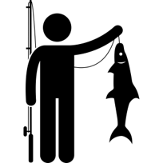

```{r setup, include=FALSE}
knitr::opts_chunk$set(echo = FALSE,message = FALSE,warning=FALSE)

xaringanExtra::use_tile_view()

```

# Insurance is an ideal tool to smooth risk

- Fisheries are highly variable

- Climate Change will increase stochastic shocks

- Overfished stocks more vulnerable to climate variability

  -   Overfishing continues to impact fisheries, especially in developing countries
  
- Greater attention from the UN and governments to mitigate risk for risk-averse fishers

- Insurance products being designed to combat climate shocks


???

Fishing is a risk activity, the environment can cause large fluctuations in stock abundance leading to uncertainty in where to harvest, and how many a fisher will get

Insurance is a great way to smooth income in a risky env.

---

# Index Insurance leading candidate for fisheries insurance

- Specifically designed for quick payouts, flexible trigger design, and minimize moral hazard
- Concept figure for index insurance 

## .seagreen[No overarching framework to ask How? Where? and Should? index insurance be used in fisheries]

---

# Research Questions

## 1) Will index insurance change optimal input use?

## 2) What conditions lead to viable index insurance products where fishers demand insurance and insurers willing to provide?

---

# Moral Hazards will always influence behavior

##.bold[Moral Hazard]: .gold[*"Decisions by insured agents that they would not otherwise take if they were uninsured"*]

## Two components of Moral Hazards

  -   "Risk Reduction" : With insurance I want to take more risk than before because insurance protects me
  
  -   "Chasing the Trigger" : If I change my behavior, I increase the probability of getting paid out


<uc-blockquote> Index Insurance negates "Chasing the Trigger", but is still subject to Risk Reduction and therefore may cause fishers to change their input decisions </uc-blockquote>
---

# Index Insurance changes inputs, but little understanding of how or why.

.pull-left[

## Index Insurance Evidence

- Empirically, maize farmers use more fertilizer in Kenya .small[(Sibiko et al., 2020)]

- Pastures stock more animals leading to environmental degradation .small[(Bulte et al., 2021; Muller et al., 2011)]
]

.pull-right[
## Indenmity Theory

- Input risk effects dictate whether a farmer wants to add more or less inputs .small[(Ramaswami 1993; Horowitz and Lichtenberg, 1993)]

- Risk-increasing inputs rise with insurance

- Risk-decreasing lower with insurance
]

<uc-blockquote> Fisheries use multiple inputs. How will index insurance change input use, and will it lead to conservation or further exacerbate overfishing?  </uc-blockquote>

---

# Index Insurance demand determined by multiple factors

.column-left[## Basis Risk

- .moss[Paying premiums in bad states of the world without receiving payouts drastically hurts welfare .small[(Clarke 2016)]]

- .moss[Fisheries have difficulty establishing clear weather impacts to productivity .small[(Free et al., 2019; Lehodey et al., 2006)]]
]

.column-center[## Trigger designs

- .moss[Fishers may have preferences to protect against catastrophic shocks or more frequent ones .small[(Lichtenberg and Iglesias, 2022)]]

- .moss[Need consistent, verifiable indices]

]

.column-right[## Costs

- .moss[Expensive premiums diminish fishers willingness to pay .small[Binswanger 2012]]

- .moss[Competitive market insurance needs to make some profit beyond just covering payouts]
]

.white[blank]

<uc-blockquote> Is is possible to offer an insurance product through a competitive market in a new industry with unknown basis risk? </uc-blockquote>


---

# Contributions to literature

## 1) First index insurance model built through a fishery perspective

- .seagreen[Conservation Finance, Fisheries management]

## 2) First index insurance model to examine input use with risk effects

- .seagreen[Risk mangement literature, insurance]

## 3) First model adding basis risk into optimal input decision

- .seagreen[Index Insurance literature]

---

## .blue[Fishers maximize expected utility by selecting input and coverage]

$$
\begin{aligned}
\max_{E,\gamma}\mathbb{E}[U]&=F(\bar{w})U_b(E,z,\gamma,p(\gamma)) &\text{Bad State} \\
&+(1-F(\bar{w}))U_g(E,z,p(\gamma)) &\text{Good State}
\end{aligned}
$$

.pull-left[
 Just and Pope Production Function
$$
\begin{aligned}
q(E,z)&=E^\alpha+zE^\beta\\
z&\sim N(0,\sigma_z)
\end{aligned}
$$
]

.pull-right[

.white[blank]

When $\beta<0$, input risk decreasing

When $\beta>0$, input risk increasing
]


## .blue[Numerical simulation]

- Monte Carlo simulation with 1000 draws from copula linked marginal distributions

- Non-linear optimization algorithm maximizes input and payout choices

- Run 19,800 scenarios for each combination of input variables .small[[Risk Aversion, Basis Risk Correlation, Premium Loading Factor, Trigger Coverage, Input Risk Effects]]

---

# Results

<iframe src="https://nggrimes.shinyapps.io/Fishery_index_insurance" width="1000" height="1000"></iframe>

---
# Discussion

.bold[.blue[Index Insurance is feasible in fisheries, but will have different impacts depending on the risk effects of the input]]

## Immediate Questions

- Do you buy the risk effect specification and its importance?

- What other considerations would you consider for proving insurance feasibility?

## Future goals and questions

- Move to two input model with mixed risk effects

- Can we identify risk effects of a fishery without expensive and time-consuming empirically studies?

- Test correlations of fisheries with potential indices


---
class: title-slide-section-gold, center, middle

# Extra Slides

---
# Potential to leverage insurance induced moral hazards to correct externalities in fisheries

##.bold[Moral Hazard]: .gold[*"Decisions by insured agents that they would not otherwise take if they were uninsured"*]

## Moral Hazards are often undesirable in insurance

- Farmer intentionally reduces yield to get an insurance payout

## .small[In fisheries with risk-sharing agreements, moral hazards leads to reduced overexploitation]

- Revenue club encourages free riders to reduce total harvest


???

Sky diving example of moral hazard

Need to know more about how moral hazards can change behavior

Heintzelman et al., 2008 and Tillman 2018 primary backbones in this idea.

Kotchen and Salant offer a possible theory justification for moral hazards in the short term for fisheries. Increase the cost initially to see biological improvements, insurers bear the initial cost.


---

# What Moral Hazards exist in a fishery

## Two components of Moral Hazards

  -   "Risk Reduction" : With insurance I want to take more risk than before because insurance protects me
  
  -   "Chasing the Trigger" : If I change my behavior, I increase the probability of getting paid out
  
<uc-blockquote> How can we design insurance to induce positive behavior change? </uc-blockquote>

???

Conditions where the two components may have opposite, confounding effects

If we can elicit positive change, we can make it incentive compatible

---

# Insurance must be incentive compatible


.column-left[

.large[.bold[ Fishers want to buy insurance]]
]

.column-center[

.large[.bold[Insurance changes behavior to promote conservation]]

]

.column-right[

 .large[.bold[Insurers willing to provide insurance]]
 
]

--

## .seagreen[This research will focus on behavior change originating from moral hazards]


---
name: milestones

# Research Objectives at PERC

## Build theoretical model to formally characterize behavior change from Insurance Induced Moral Hazards

.pull-left[[1.](#prop-1) How does insurance increase or decrease fishing effort?
  
  - Test across different triggers [Harvest - Area - Weather]
  
[2.](#prop-2) Will insurance improve fisher welfare?  

]

.pull-right[
[3.](#prop-3) Could an insurer act as a social planner?

[4.](#prop-4) Does adverse selection create leakage problems?

[5.](#prop-5) Entry-Exit Dynamics
]

## Simulate model outcomes with representative fishery and weather data

1. Capture metrics of interest for insurance companies (Expected Negative Profits, Required Capital, etc.)

2. Show potential dynamic effects. 


---

# Active Insurance pushes

.pull-left[
- Caribbean Oceans and Aquaculture Sustainability Facility (COAST)

    - Index Insurance product to protect fishers from hurricanes and tropical storms

    - Quid Pro Quo style of conservation, requires vessel regrestration 
    
- RARE Initiative to build index insurance in the Philippines

    - Pilot enrolled 4,000 fishers
    
    - Expected to reach 50,000
    
    - Operated through Savings Clubs
    
    - Anecdotal behavior change

]

.pull-right[


]

---

# One previous attempt at fishing productivty insurance

Concluded a US RMA like revenue and yield insurance program would be unsuccessful. Instead better management is the solution (Herrmann et al., 2004)

1. Insurance cost deemed to high to US RMA standards

2. Difficulty in defining fishery peril (how exactly does weather impact a fisher?)

3. Moral hazard of "fishing the insurance"
  
  - Operators staying in when earning payouts instead of exiting
  
No definitive follow up study in 20 years and interest in fizzled out
  
<uc-blockquote>However, insurance may be possible in other fisheries. New insurance products and fishery technology have come online to improve viability of insurance. Behavior was ignored in determining fisher responses and there was no formalization of the full moral hazard effect </uc-blockquote>

---

# There are three pathways for insurance to change behavior

1. Quid Pro Quo

  - Fishers want insurance and are willing to agree to conservation improving stipulations

2. Collection Action

  - Insurance leverages the political economy to pressure the regulator or promote collective cooperation

3. Moral Hazards

  - "Risk Reduction" : With insurance I want to take more risk than before because insurance protects me
  
  - "Chasing the Trigger" : If I change my behavior, I increase the probability of getting paid out
  
<uc-blockquote> My paper will focus on moral hazard behavior change because no matter the design or setting, some influence will be present. </uc-blockquote>
  
  
???

Kotchen and Salant offer a possible theory justification for moral hazards in the short term for fisheries. Increase the cost initially to see biological improvements, insurers bear the initial cost.

---

# Federal fishery diaster relief (Bellquist et al., 2021)


.center[
]
     
     
---

# Insurance exists on a spectrum


---